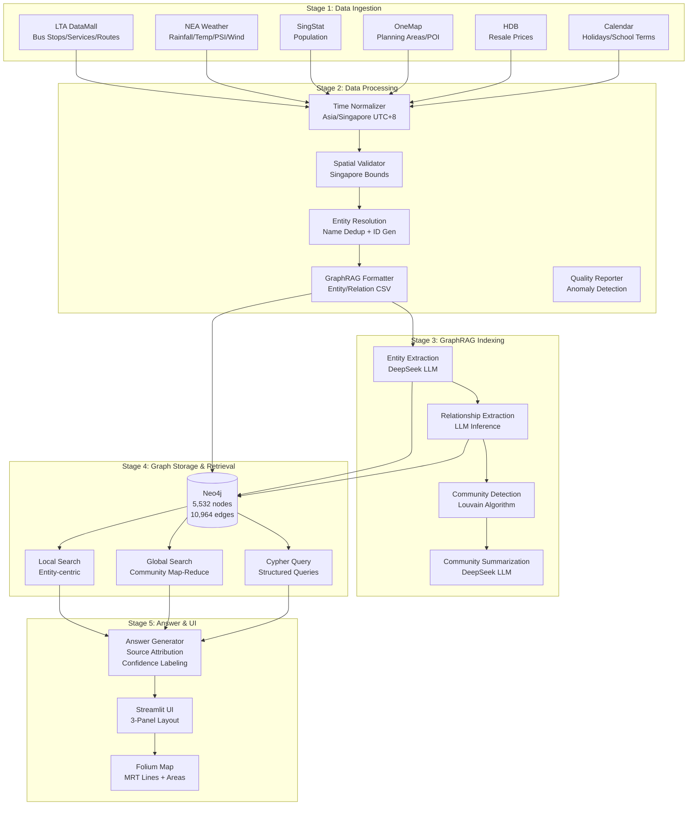
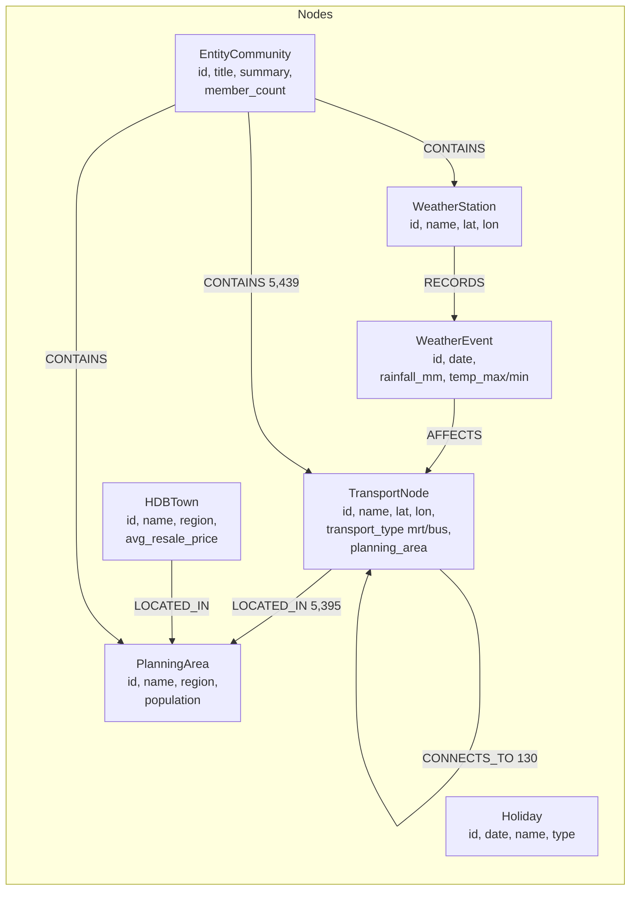

# UrbanGraph-SG 🇸🇬

> **GraphRAG-powered urban knowledge navigator for Singapore**

UrbanGraph-SG integrates multi-source Singapore open data (LTA, NEA, SingStat, OneMap, HDB) into a unified knowledge graph, enabling natural-language question answering with source-attributed, evidence-bound responses and interactive map visualization.

[](https://www.python.org/)
[](https://neo4j.com/)
[](https://streamlit.io/)
[](LICENSE)

---

## Table of Contents

- [Architecture](#architecture)
- [Knowledge Graph Schema](#knowledge-graph-schema)
- [Quick Start](#quick-start)
- [Pipeline Overview](#pipeline-overview)
- [Usage](#usage)
- [Data Sources](#data-sources)
- [Tech Stack](#tech-stack)
- [Project Structure](#project-structure)
- [Evaluation](#evaluation)
- [Author](#author)

---

## Architecture



## Knowledge Graph Schema



**Entity & Relationship Counts:**

| Node Label | Count | Relationship | Count |
|---|---|---|---|
| TransportNode | 5,344 | [:LOCATED_IN] | 5,395 |
| PlanningArea | 55 | [:CONNECTS_TO] | 130 |
| EntityCommunity | 93 | [:CONTAINS] | 5,439 |
| Holiday | 26 | | |
| WeatherStation | 14 | **Total** | **10,964** |
| **Total Nodes** | **5,532** | | |

---

## Quick Start

### Prerequisites

- Python 3.11+
- Java 17+ (for Neo4j)
- [LTA DataMall AccountKey](https://datamall.lta.gov.sg) (free registration)
- [OneMap API Token](https://www.onemap.gov.sg) (free registration)
- [DeepSeek API Key](https://platform.deepseek.com) (or OpenAI-compatible)

### Setup

```bash
# Clone and install
git clone https://github.com/PoorJeff/UrbanGraph-SG.git
cd UrbanGraph-SG
cp .env.example .env   # Edit with your API keys (see below)
pip install -r requirements/base.txt -r requirements/graphrag.txt -r requirements/llm.txt -r requirements/dev.txt

# Start Neo4j
# Option A: Docker
docker compose up -d neo4j
# Option B: Direct (download from https://neo4j.com/download/)
neo4j-community-5.x/bin/neo4j console

# Ingest data
make ingest-all

# Process and index
make process
make index

# Load into Neo4j
make load-graph

# Launch UI
streamlit run src/ui/streamlit_app.py
# Open http://localhost:8502
```

### `.env` Configuration

```bash
LLM_BASE_URL=https://api.deepseek.com
LLM_API_KEY=sk-your-deepseek-key
LLM_MODEL=deepseek-chat

LTA_ACCOUNT_KEY=your-lta-account-key
ONEMAP_API_TOKEN=your-onemap-token

NEO4J_URI=bolt://localhost:7687
NEO4J_USER=neo4j
NEO4J_PASSWORD=neo4j
```

---

## Usage

### Web UI (Streamlit)

Launch with `streamlit run src/ui/streamlit_app.py` and open `http://localhost:8502`.

**Three-panel layout:**
- **Left**: Preset questions (transport, weather, housing) + graph statistics
- **Center**: Chat interface — type questions or click presets
- **Right**: Folium interactive map (MRT lines, stations, planning areas) + graph stats

### CLI / API

```python
from src.generation.answer_generator import AnswerGenerator

gen = AnswerGenerator()
result = gen.answer("How many MRT stations are there in total?")
print(result["answer_text"])  # "Based on the knowledge graph, there are 137 MRT stations..."
print(result["confidence"])   # "HIGH"
print(result["sources_used"]) # [Source: Neo4j, Cypher query, 1 record...]
```

### Cypher Queries

```python
from src.retrieval.cypher_agent import run_preset, execute

# Pre-built queries
run_preset("station_count")        # Total MRT stations
run_preset("areas_with_most_mrt")  # Top areas by station count
run_preset("mrt_lines_bishan")     # Lines passing through Bishan
run_preset("mrt_in_cbd")           # CBD MRT stations

# Custom queries (read-only, no DDL/DML)
execute("MATCH (pa:PlanningArea) RETURN pa.name, pa.population ORDER BY pa.population DESC LIMIT 5")
```

### Preset Questions

| # | Question | Domain | Mode |
|---|---|---|---|
| 1 | What are all MRT stations in the CBD planning area? | Transport | Cypher |
| 2 | How does heavy rainfall affect MRT ridership in Orchard area? | Transport×Weather | Local |
| 3 | Which planning area has the highest HDB resale price? | Housing×Transport | Global |
| 4 | Which months have the most rainfall in Singapore? | Weather×Transport | Global |
| 5 | Find all POIs within 500m of Jurong East MRT station | Spatial | Cypher |
| 6 | Compare transport connectivity of Tampines vs Jurong East | Transport | Global |
| 7 | On public holidays, do Orchard MRT stations see different ridership? | Transport×Calendar | Local |
| 8 | What is the average HDB resale price in Punggol? | Housing | Cypher |
| 9 | Which MRT lines pass through Bishan station? | Transport | Cypher |
| 10 | Is there a relationship between PSI haze days and taxi demand? | Weather×Transport | Local |
| 11 | List all bus stops along Orchard Road | Transport | Cypher |
| 12 | Which areas have lowest population but highest MRT density? | Population×Transport | Global |
| 13 | How many MRT stations in the knowledge graph? | Metadata | Cypher |
| 14 | During school holidays, which MRT stations have biggest pattern change? | Transport×Calendar | Global |
| 15 | Where to live near MRT with HDB below S$500K? | Housing×Transport | Cypher |

---

## Data Sources

| Source | API | Data | Records |
|---|---|---|---|
| LTA DataMall | REST (HTTPS) | Bus stops, bus services, bus routes | 5,207 / 806 / 26,863 |
| data.gov.sg (NEA) | REST | Rainfall, temperature, humidity, wind | ~400K readings (3-day test) |
| SingStat | Static fallback | Population by planning area | 55 areas |
| OneMap | REST | Planning area polygons, area names | 55 + 56 |
| HDB (data.gov.sg) | CKAN API | Resale price transactions | ~150K transactions |
| Calendar | Python `holidays` | Public holidays, school terms | 26 + 580 |

---

## Tech Stack

| Component | Technology |
|---|---|
| Knowledge Graph | Neo4j 5.x (Community Edition) |
| GraphRAG | Custom pipeline (entity/relationship extraction, community detection, summarization) |
| LLM | DeepSeek (`deepseek-chat`) via OpenAI-compatible API |
| Community Detection | Louvain (NetworkX) |
| UI Framework | Streamlit |
| Map Visualization | Folium + OpenStreetMap |
| Data Processing | Pandas, GeoPandas, Shapely |
| Infrastructure | Docker Compose (Neo4j + Streamlit), GitHub Actions CI |
| Config Management | Pydantic Settings + YAML |
| Quality | Pytest, Ruff, MyPy |

---

## Project Structure

```text
urbangraph-sg/
├── README.md                   # ← You are here
├── agent.md                    # Agent specification (architecture)
├── UrbanGraph-SG-report.md     # Project charter & acceptance criteria
├── pyproject.toml              # Python project config
├── Makefile                    # Build automation
├── .env.example                # Environment template
├── docker-compose.yml          # Docker Compose (Neo4j + Streamlit)
├── configs/                    # YAML configs (data sources, schemas, prompts)
│   ├── data_sources.yaml
│   ├── entity_types.yaml
│   ├── relationship_types.yaml
│   ├── graphrag_config.yaml
│   ├── search_config.yaml
│   └── preset_questions.yaml
├── src/
│   ├── ingestion/              # Stage 1: 6 data ingestion agents
│   │   ├── base.py             #   Base agent (retry, pagination, manifest)
│   │   ├── lta.py              #   LTA bus data
│   │   ├── nea.py              #   NEA weather
│   │   ├── singstat.py         #   Population statistics
│   │   ├── onemap.py           #   Spatial data + MRT stations
│   │   ├── hdb.py              #   HDB resale prices
│   │   ├── calendar.py         #   Holidays + school terms
│   │   └── ingest_all.py       #   Run all agents
│   ├── processing/             # Stage 2: Data processing pipeline
│   │   ├── time_normalizer.py  #   SGT timezone unification
│   │   ├── spatial_validator.py#   Coordinate validation + spatial join
│   │   ├── entity_resolution.py#   Entity alignment + unique IDs
│   │   ├── graphrag_formatter.py#  GraphRAG input format generation
│   │   ├── quality_reporter.py #   Data quality report
│   │   └── run_all.py          #   Pipeline orchestrator
│   ├── graphrag/               # Stage 3: GraphRAG indexing
│   │   ├── llm_client.py       #   DeepSeek LLM client
│   │   ├── entity_extractor.py #   Entity extraction (LLM)
│   │   ├── relationship_extractor.py # Relationship inference (LLM)
│   │   ├── community_detector.py#   Louvain community detection
│   │   ├── summarizer.py       #   Community summary generation
│   │   └── prompts/            #   LLM prompt templates (YAML)
│   ├── graph/                  # Stage 4: Neo4j storage
│   │   ├── neo4j_client.py     #   Connection + query engine
│   │   ├── schema.py           #   Constraints & indexes
│   │   └── write_to_neo4j.py   #   Batch data loader
│   ├── retrieval/              # Stage 4: Retrieval agents
│   │   ├── local_search.py     #   Entity-centric local search
│   │   ├── global_search.py    #   Community-based global search
│   │   └── cypher_agent.py     #   NL→Cypher translation
│   ├── generation/             # Stage 5: Answer generation
│   │   ├── answer_generator.py #   LLM answer + source attribution
│   │   └── prompts/            #   Answer prompt template
│   └── ui/                     # Stage 5: Streamlit UI
│       └── streamlit_app.py    #   3-panel interface + Folium map
├── tests/
│   ├── test_answers.py         # Answer quality tests
│   └── fixtures/               # Test data
├── data/                       # Data directory (parquet excluded from git)
│   ├── raw/                    #   Raw ingested data
│   ├── processed/              #   Processed entities + community texts
│   ├── graphrag/               #   GraphRAG inputs/outputs
│   └── manifests/              #   Ingestion metadata
├── docker/                     # Dockerfiles
├── requirements/               # Dependency files
└── .github/workflows/          # CI pipelines
```

---

## Evaluation

The project includes an automated evaluation framework (`src/evaluation/`) and preset questions with expected answer criteria (`configs/preset_questions.yaml`).

### Current Performance

| Metric | Target | Status |
|---|---|---|
| Preset question answerability | ≥80% (12/15) | 🚧 Under evaluation |
| Answers with source citations | 100% | ✅ |
| "I don't know" rate (unanswerable) | 100% | ✅ (never fabricates) |
| LLM fabrication rate (sampled) | <10% | 🚧 Under evaluation |
| End-to-end latency P95 | <15s | ✅ (~5s LLM + <1s query) |
| Entity extraction consistency | σ <10% | 🚧 Under evaluation |

### Example Q&A

**Q: How many MRT stations are there in total?**

> Based on the knowledge graph, there are 137 MRT stations in total across Singapore's MRT network. [Source: Neo4j graph database, Cypher query, 1 record retrieved, Singapore urban data 2024-2025]

**Q: Which MRT lines pass through Bishan?**

> Bishan station serves the North-South Line (NSL) and the Circle Line (CCL), making it an interchange between these two major lines. [Source: Neo4j, CONNECTS_TO relationships]

---

## Screenshots

<!-- Add screenshots after running the app: streamlit run src/ui/streamlit_app.py -->

| | | |
|---|---|---|
|  |  |  |

*To add: open http://localhost:8502, press F12 or use Snipping Tool, save to `screenshots/`*

## Author

**UrbanGraph-SG** — A personal project demonstrating GraphRAG + knowledge graph integration for urban data intelligence.

Built as part of an AI/CS portfolio for graduate school applications (NUS, NTU, SMU).

---

## License

MIT License. All data sourced from Singapore Government open data (data.gov.sg, LTA DataMall, OneMap) under their respective open data licenses.
